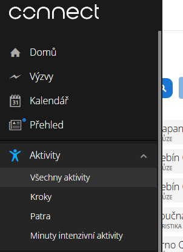

# Paths_and_patterns
Bunch of scripts to help me analyze if I am keeping my training plan.

## Goal of this "app"
I have set up a regular training goal as a lot of people do. However, Garmin Connect does not make it easy for me to see metrics which I most need and tracking progress is then rather difficult for me.

Moreover, my body is somwehat of not typical sportperson, therefore also the metrics followed are somewhat niche. 

Maybe the biggest reason for this is, it is a nice practice and it is fun to do it.

# How to set up
You need to have python installed.
Then it should be just run `setup.py` and it will install `requirements.txt`

## Notes
* data import is still manually go to the device folder and copy data to its correct folder
* currently it is being transformed into a CLI/TUI app

# Becoming obsolete
* it uses MANUALLY downloaded Garmin data and then compares them to a plan and previous weeks.
* https://connect.garmin.com/modern/activities 

* `src/template.xlsx` is renamed to `training_plan.xlsx` into which you are expected to write your own training plan